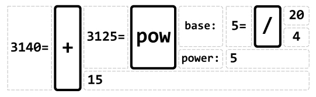
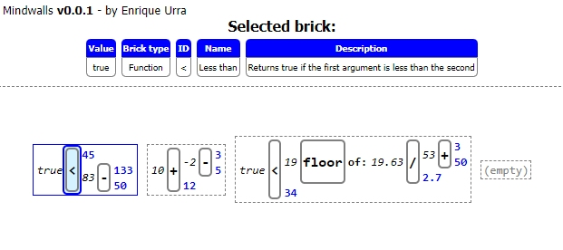

# Mindwalls prototype

*Mindwalls* is an early idea and prototype about a visual programming environment or system, in which programs are gradually designed and assembled from granular components, *bricks*, towards more complex and high-level constructs, the *walls*.  Conceptually, this system tries to synergically integrate common concepts from the programming world such as modularity and functional mindset, while addressing several challenges derived from a visual programming environment, in comparison to a text-based one:

- How bricks can be modularly combined and arranged within a visual workspace, in a way such that computations at different abstraction levels can be constructed and reused.
- How to manipulate bricks for building programs with the efficiency and flexibility that source code (text) could actually provide.
- How to evaluate and improve a brick-based implementation through a minimum feedback loop
possible.

The latter one is particularly relevant, as the main benefit of a visual programming environment is to gather immediate feedback from the program that is being built, condition that source code cannot always provide. On the other side, source code provide program editing benefits that are difficult to comply for visual environments, such as lower viscosity, i.e., the ease to modify the program structure while preserving its design.

Mindwalls, as [many other initiatives](https://github.com/yairchu/awesome-structure-editors/tree/main), seek the progress towards new programming paradigms and models, by raising the abstraction level of current methods and making the programming activity more accesible to different developer profiles. As programming is a deeply creative process, it is significant to provide better tools for the purpose. Several people has deepened more in this topic, such as Bret Victor on her essay [learnable programming](https://worrydream.com/LearnableProgramming/) (check it out!).

In this prototype, walls are defined by nesting multiple bricks from right to left, such as the following example diagram:

There are bricks that handle inputs (such as `pow`), i.e., the bricks on their right. Such bricks also produce an output, shown at their left (for `pow`, the result is `3125`). In this way, such result can be used as inputs of other bricks that follow the flow towards left. Conceptually, the Mindwalls idea is to define components that can "connect" different walls by their results, allowing to create complex computations distributed among different walls.

The current prototype is pretty simple, there is a screenshot of a "live" wall:

It was implemented with [Node.js](https://nodejs.org/), [Electron](https://www.electronjs.org/) and [JQuery](https://jquery.com/), so it is currently a desktop app. A release in the repo [is available here](https://github.com/eurra/mindwalls/releases/tag/v1.0.0). In this prototype, you can:

- Move between walls, using the keys `ctrl+arrows`.
- Move between bricks in a wall, using the arrows.
- Edit a literal brick (the ones with numbers), using `enter`. Press `enter` again after changing the literal value for updating de brick and further calculations towards left, or `esc` for cancel. This is an interesting feature, regarding how the feedback loop is minimized, as mentioned before.

There were many other ideas for further development regarding Mindwalls, but time is limited :) Please check [an early documentation](docs/early-docs.pdf) with other features which were considered. If you have any comment on these ideas, please feel free to write me: enrique.urra@gmail.com.
